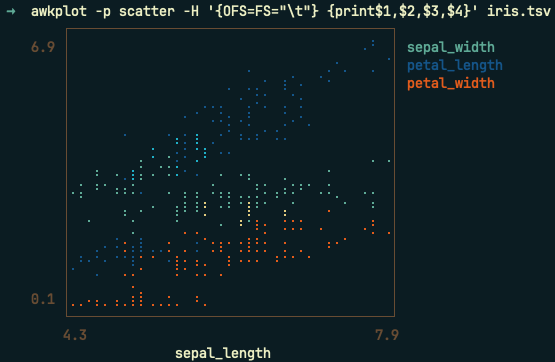

# awkplot

`awk` piped to [`uplot`](https://github.com/red-data-tools/YouPlot) for terminal-only plots that feel like writing awk on the command line.

The coding world is shifting its efforts to writing inscrutible `Rust` scripts. This is mistake. Speed? Type safety? Who needs it!

Instead, we should be reducing our cognitive burden by doing more analysis using the sweet, sweet `awk` syntax. `Rust` advocates will tremble when they see you enjoying a relaxing terminal session with `awkplot`, absolutely dominating tabular data.




```
awkplot [awkplot-opts] [awk-opts] 'awk program' [file ...]
```

## What's the point of this?

Good question. You *COULD* just pipe awk to `uplot` yourself, but it just feels better doing it this way.

## Dependencies

- awk or gawk
- youplot

## Install

**Option A — one-liner (macOS / Linux):**

```bash
curl -fsSL https://raw.githubusercontent.com/mtisza1/awkplot/main/install.sh | bash
```

The installer checks for `python3`, `awk`, and `uplot`, installs `uplot` via Homebrew (macOS) or RubyGems/apt (Linux) if missing, then drops `awkplot` into `~/.local/bin`.

Customize with env vars:

```bash
# install to a different dir
AWKPLOT_PREFIX=/usr/local/bin curl -fsSL .../install.sh | bash

# skip dep installation (bring your own uplot)
AWKPLOT_SKIP_DEPS=1 curl -fsSL .../install.sh | bash
```

**Option B — drop on PATH manually:**

First, clone this repo.

```bash
chmod +x awkplot
cp awkplot awkplot_cli.py /usr/local/bin/   # or any dir on your PATH
```

**Option C — pip:**

```bash
pip install .
```

## Flags

### awk passthrough

| Flag | Description |
|------|-------------|
| `-F SEP` | Field separator (forwarded to `awk`) |
| `-v VAR=VAL` | Variable assignment, repeatable |
| `-f PROGFILE` | Read awk program from file, repeatable |

### plot options

| Flag | Description |
|------|-------------|
| `-p TYPE` | Plot type: `hist` `bar` `line` `lineplot` `scatter` `density` `box` `count`  [default: `hist`] |
| `-H` | First output row is column headers |
| `-c COLORS` | Comma-separated color(s), e.g. `red,blue` |
| `-s H:W` | Plot height:width, e.g. `20:60` |
| `-t TITLE` | Plot title |
| `-d DELIM` | Output column delimiter for uplot |
| `--dry-run` | Print the `awk \| uplot` command without running it |
| `--uplot-args ARGS` | Extra arguments passed through to uplot (quote the string) |
| `--version` | Show version and exit |
| `--help` | Show usage |

## Examples

```bash
# Histogram of column 3
awkplot -p hist '{print $3}' data.tsv

# Scatter from a CSV with headers, custom size and color
awkplot -F, -H -p scatter -c cyan -s 20:60 '{print $2, $5}' data.csv

# Filter then bar chart from stdin
cat data | awkplot -v t=10 -p bar '$1 > t {print $2, $3}'

# Awk program from a file
awkplot -f prog.awk -p line data.tsv

# Density plot with title
awkplot -p density -t "Response times" '{print $4}' access.log

# Preview the generated command without running it
awkplot --dry-run -F, -p scatter '{print $1,$2}' data.csv
```

## How it works

`awkplot` builds two commands from your flags and runs them as a pipeline:

```
awk [awk-flags] 'program' [files]  |  uplot <type> [uplot-flags]
```

`--dry-run` prints the shell-quoted pipeline so you can inspect or tweak it.
